# Chapter 1 - Exploratory Data Analysis


以下は、「データサイエンスのための統計学入門」（Peter Bruce, Andrew Bruce、原題 Practical Statistics for Data Scientists）の第１章：探索的データ解析を MATLAB で実行した例です。


もともとの R コードはこちら（[GitHub](https://github.com/andrewgbruce/statistics-for-data-scientists)）にあり、データも著者によって [Google Drive](https://drive.google.com/drive/folders/0B98qpkK5EJemYnJ1ajA1ZVJwMzg) もしくは [Dropbox](https://www.dropbox.com/sh/clb5aiswr7ar0ci/AABBNwTcTNey2ipoSw_kH5gra?dl=0) から入手可能です。データファイル（csv）はすべてフォルダ ..\psds_data 内にあるとします。


## 実行環境

   -  MATLAB R2020a 
   -  Statistics and Machine Learning Toolbox 

  
# 1.3.3 例: 人口と殺人事件発生率の代表値の推定


注意：R2019a 以前のバージョンでは `Murder.Rate` は MATLAB の変数名としては使えないので読み込み時に `Murder_Rate` に変更されます（警告が出ます）。


変数名を付けてデータの読み込む場合は `readtable` 関数（[doc](https://jp.mathworks.com/help/matlab/ref/readtable.html)）が便利。


```matlab:Code
state = readtable('..\psds_data\state.csv');
```


```text:Output
警告: ファイルからの列ヘッダーは、table の変数名の作成前に、有効な MATLAB 識別子になるように変更されました。元の列ヘッダーは、VariableDescriptions プロパティに保存されています。
元の列ヘッダーを table 変数名として使用するには、'PreserveVariableNames' を true に設定します。
```


州別人口と殺人事件発生率の最初の数行（表 1.2）を確認します。


```matlab:Code
head(state)
```

| |State|Population|Murder_Rate|Abbreviation|
|:--:|:--:|:--:|:--:|:--:|
|1|'Alabama'|4779736|5.7000|'AL'|
|2|'Alaska'|710231|5.6000|'AK'|
|3|'Arizona'|6392017|4.7000|'AZ'|
|4|'Arkansas'|2915918|5.6000|'AR'|
|5|'California'|37253956|4.4000|'CA'|
|6|'Colorado'|5029196|2.8000|'CO'|
|7|'Connecticut'|3574097|2.4000|'CT'|
|8|'Delaware'|897934|5.8000|'DE'|


**参考**：R2019b 以降は `'PreserveVariableNames'` を `'true'` に設定するとそのまま変数名として使えますが、呼び出し方が多少不便。


```matlab:Code
tmp = readtable('state.csv','PreserveVariableNames',true);
tmp.("Murder.Rate");
```

## 人口の平均値、トリム平均、中央値を計算


簡単な統計値を計算してみます。まずは平均値と中央値はそれぞれ `mean` 関数と `median` 関数で計算します。


```matlab:Code
popMean = mean(state.Population)
```


```text:Output
popMean = 6.1629e+06
```


```matlab:Code
popMedian = median(state.Population)
```


```text:Output
popMedian = 4.4364e+06
```


トリム平均はデータの両端を取り除いたデータの平均値です。外れ値に対して影響を受けにくくなります。例えば上位 10%、下位 10 % を取り除くトリム平均は以下。


```matlab:Code
% 両端合わせて 20% = 10 州取り除く
popTrimMean = trimmean(state.Population,20) % 要 Statistics and Machine Learning Toolbox
```


```text:Output
popTrimMean = 4.7837e+06
```


人口のヒストグラム表示には `histogram` 関数（[doc](https://jp.mathworks.com/help/matlab/ref/matlab.graphics.chart.primitive.histogram.html)）を使用。各平均値をプロットしてみます・・そんなに変わらないですね。


```matlab:Code
figure
histogram(state.Population,20)
title("州人口のヒストグラムと代表値")
text(popMean,10,'\downarrow 平均値','Color','red','FontSize',14)
text(popMedian,11,'\downarrow 中央値値','Color','red','FontSize',14)
text(popTrimMean,12,'\downarrow トリム平均値','Color','red','FontSize',14)
```


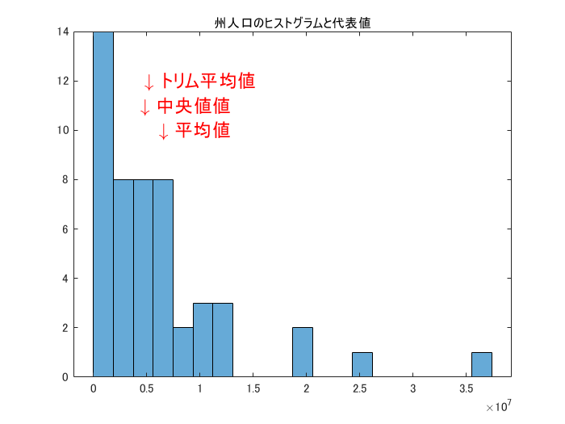

## 平均殺人事件発生率：加重平均、加重中央値


加重平均は重みをかけたベクトルに `mean` 関数です。


```matlab:Code
wMean = mean(state.Murder_Rate.*state.Population/mean(state.Population))
```


```text:Output
wMean = 4.4458
```


加重中央値はデータをソートし、それぞれの重みの総和が真ん中に相当する位置にあるデータを見つける処理をします。ちょっとややこしい。


```matlab:Code
[sortedRate,idx] = sort(state.Murder_Rate); % データのソート
weight = state.Population/sum(state.Population); % 重み
sortedWeight = weight(idx); % データ順に並べ替えた重み
idxMedian = find(cumsum(sortedWeight)>sum(weight)/2,1); % 半分以上の位置（index）
wMedian = sortedRate(idxMedian)
```


```text:Output
wMedian = 4.4000
```


上と同じようにヒストグラムで確認してみます。あまり変わらず。


```matlab:Code
figure
histogram(state.Murder_Rate,20)
title("平均殺人事件発生率のヒストグラムと代表値")
text(wMean,5,'\downarrow 加重平均','Color','red','FontSize',14)
text(wMedian,6,'\downarrow 加重中央値','Color','red','FontSize',14)
text(mean(state.Murder_Rate),7,'\downarrow 平均値','Color','red','FontSize',14)
```


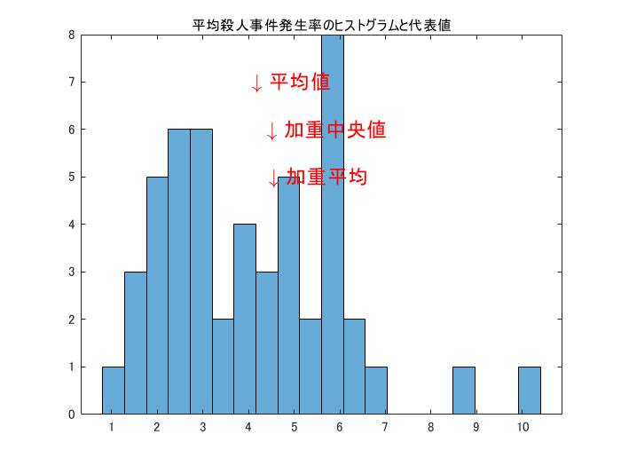

# 1.4.3 例：州別人口の散らばりの推定


標準偏差（`std` 関数）、四分位範囲（`iqr` 関数）、中央値絶対偏差（`mad` 関数）を計算しますが、R での計算結果との違いに注意。


```matlab:Code
popStd = std(state.Population)
```


```text:Output
popStd = 6.8482e+06
```


```matlab:Code
popIQR = iqr(state.Population) % 要 Statistics and Machine Learning Toolbox
```


```text:Output
popIQR = 4898199
```


これは0.75 分位数から 0.25 分位数を引いたものと同じ。


```matlab:Code
popQ = quantile(state.Population,0.75)-quantile(state.Population,0.25)
```


```text:Output
popQ = 4898199
```


MATLAB の `mad` 関数は平均値絶対偏差 (`flag = 0`、既定) か中央値絶対偏差 (`flag = 1`) を計算します。中央値絶対偏差の定義は `median(abs(X – median(X)))` です。


```matlab:Code
popMad = mad(state.Population,1) % 要 Statistics and Machine Learning Toolbox
```


```text:Output
popMad = 2596702
```


一応検算。


```matlab:Code
median(abs(state.Population-median(state.Population)))
```


```text:Output
ans = 2596702
```

# 1.5.1 パーセンタイルと箱ひげ図


州別の殺人事件発生率のパーセンタイル（表1.4）を表示してみます。


```matlab:Code
quantile(state.Murder_Rate,[0.05 0.25 0.50 0.75 0.95])
```


```text:Output
ans = 1x5    
    1.6000    2.4000    4.0000    5.6000    6.6000

```


州別人口の箱ひげ図（図1.2）で外れ値など確認しやすくなります。


```matlab:Code
boxplot(state.Population)
```


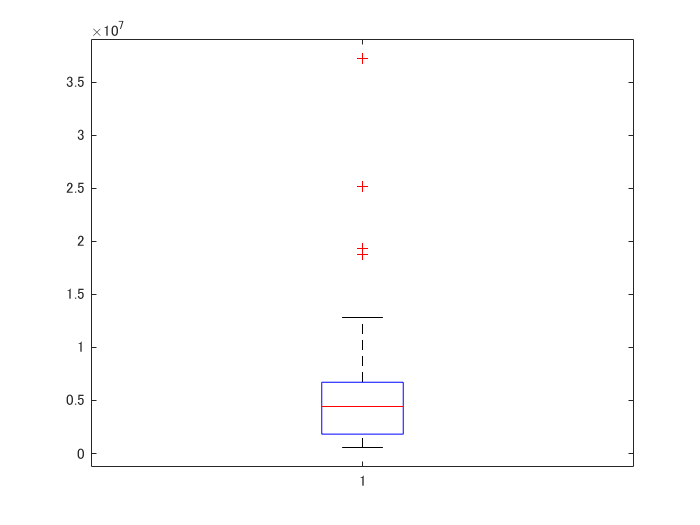


以前より `boxplot` という関数が Statistics and Machine Learning Toolbox にありますが、R2020a からは `boxchart` という関数が MATLAB 本体で使えます。`boxchart` 関数（[doc](https://www.mathworks.com/help/matlab/ref/boxchart.html)）の方が見栄えを調整しやすくなっています。


```matlab:Code
if ~verLessThan('matlab','9.8')
    % -- Code to run in MATLAB R2020a and later here --
    boxchart(state.Population)
end
```


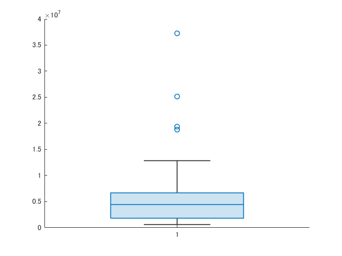

# 1.5.2 度数分布表とヒストグラム


ビンの幅を指定して各ビンの度数（データ数）を算出します。`histocounts` 関数が使えます。


```matlab:Code
edges = linspace(min(state.Population), max(state.Population), 11);
[N, ~, bin] = histcounts(state.Population,edges);
```


bin に各州がどのビンに入っているかの情報がはいります。例えば


```matlab:Code
join(state.Abbreviation(bin==3))
```


```text:Output
ans = 
    {'GA MI NJ NC OH VA'}

```


といった感じ。ですので州別人口の度数分布表（表1.5 ）を再現するなら・・


```matlab:Code
histTable = [];
for binID=1:10
    binRange = [edges(binID), edges(binID+1)];
    counts = N(binID);
    stateList = join(state.Abbreviation(bin==binID));
    histTable = [histTable; table(binID, binRange, counts, stateList)];
end
histTable
```

| |binID|binRange|counts|stateList| |
|:--:|:--:|:--:|:--:|:--:|:--:|
|1|1|563626|4232659|24|'AK AR CT DE HI ID IA KS ME MS MT NE NV NH NM ND OK OR RI SD UT VT WV WY'|
|2|2|4232659|7901692|14|'AL AZ CO IN KY LA MD MA MN MO SC TN WA WI'|
|3|3|7901692|11570725|6|'GA MI NJ NC OH VA'|
|4|4|11570725|15239758|2|'IL PA'|
|5|5|15239758|18908791|1|'FL'|
|6|6|18908791|22577824|1|'NY'|
|7|7|22577824|26246857|1|'TX'|
|8|8|26246857|29915890|0|''|
|9|9|29915890|33584923|0|''|
|10|10|33584923|37253956|1|'CA'|


ヒストグラムを書くなら `hisgtogram` 関数。


```matlab:Code
histogram(state.Population, edges)
xlabel('Population')
ylabel('Frequency')
```


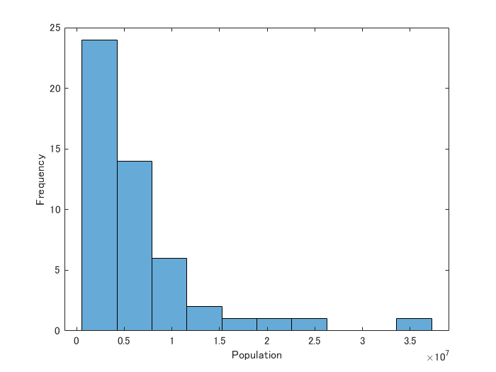

# 1.5.3 密度推定


カーネル密度を推定するなら ksdensity 関数（[doc](https://jp.mathworks.com/help/stats/ksdensity.html)）。標本データに対する確率密度推定値を計算します。


```matlab:Code
histogram(state.Murder_Rate,[0:12],'Normalization',"pdf")
hold on
[f,xi] = ksdensity(state.Murder_Rate);
plot(xi,f,'LineWidth',3);
hold off
xlabel('Murder Rate (per 100,000)')
ylabel('Density')
```


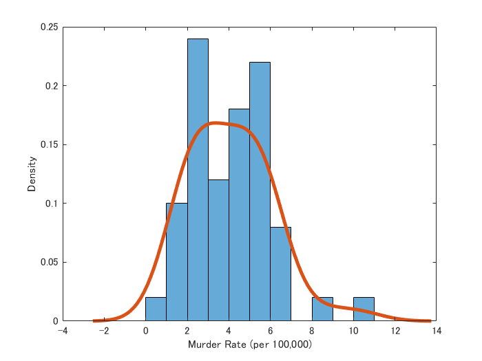

# 1.6 バイナリデータとカテゴリデータの探索


ダラス空港の原因別飛行機遅延のデータを使用します。まずは `readtable` で読み込み。


```matlab:Code
asdfw = readtable("..\psds_data/dfw_airline.csv")
```

| |Carrier|ATC|Weather|Security|Inbound|
|:--:|:--:|:--:|:--:|:--:|:--:|
|1|6.4263e+04|8.4857e+04|1.1235e+04|343.1500|1.1843e+05|


棒グラフで原因別の遅延回数をプロットします。


```matlab:Code
x = asdfw.Properties.VariableNames;
y = asdfw.Variables;
bar(categorical(x),y) % x 座標データはカテゴリー型変数で。
title("ダラス空港の原因別飛行機遅延")
```


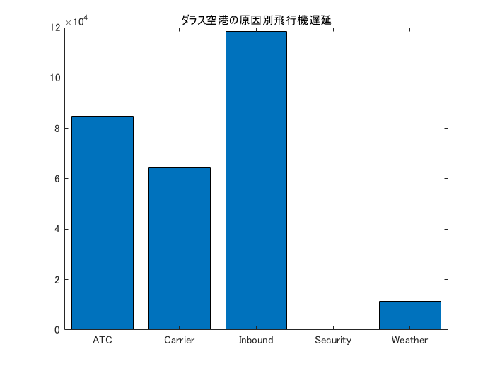

# 1.7 相関


データの相関について。ここでは `sp500_data.csv` と `sp500_sectors.csv` の株価情報を取り扱います。


## データ読み込み

```matlab:Code
sp500DailyReturns = readtable("..\psds_data/sp500_data.csv"); % S&P 500 Daily Returns
```


```text:Output
警告: ファイルからの列ヘッダーは、table の変数名の作成前に、有効な MATLAB 識別子になるように変更されました。元の列ヘッダーは、VariableDescriptions プロパティに保存されています。
元の列ヘッダーを table 変数名として使用するには、'PreserveVariableNames' を true に設定します。
```


```matlab:Code
sp500Symbols = readtable("..\psds_data/sp500_sectors.csv"); % Selected S&P Symbols
```

## データの前処理


データの一部冒頭だけ確認しておきます。`sp500DailyReturns` は各銘柄の株価変化率。


```matlab:Code
head(sp500DailyReturns(:,1:5))
```

| |Var1|ADS|CA|MSFT|RHT|
|:--:|:--:|:--:|:--:|:--:|:--:|
|1|1993-01-29|0|0.0601|-0.0221|0|
|2|1993-02-01|0|-0.1804|0.0276|0|
|3|1993-02-02|0|-0.1203|0.0359|0|
|4|1993-02-03|0|0.0601|-0.0249|0|
|5|1993-02-04|0|-0.3608|-0.0608|0|
|6|1993-02-05|0|0.0301|0.0939|0|
|7|1993-02-08|0|0.0301|-0.0607|0|
|8|1993-02-09|0|-0.0902|-0.0635|0|


1993 年からの情報が入っていますが、ここでは 2012年7月1日以降のデータのみを使用します。`timetable` 型を使うと便利。


まず変数名 `Var1` で読み込んでいる日付情報を時間データとして `timetable` 型に変換。その後 2012/7/1 の日付以降のデータを以下のように抽出。


```matlab:Code
sp500Returns = table2timetable(sp500DailyReturns,'RowTimes',"Var1");
sp500Returns2012 = sp500Returns(sp500Returns.Var1 > datetime(2012,7,1),:);
```


次に `sp500Symbols` は銘柄のセクターやティッカー名などの情報が入っています。


```matlab:Code
head(sp500Symbols)
```

| |sector|sector_label|sub_sector|symbol|
|:--:|:--:|:--:|:--:|:--:|
|1|'information_technology'|'Technology'|'data_processing_\&_outsourced_services'|'ADS'|
|2|'information_technology'|'Technology'|'systems_software'|'CA'|
|3|'information_technology'|'Technology'|'systems_software'|'MSFT'|
|4|'information_technology'|'Technology'|'systems_software'|'RHT'|
|5|'information_technology'|'Technology'|'it_consulting_\&_services'|'CTSH'|
|6|'information_technology'|'Technology'|'it_consulting_\&_services'|'CSC'|
|7|'information_technology'|'Technology'|'it_consulting_\&_services'|'EMC'|
|8|'information_technology'|'Technology'|'it_consulting_\&_services'|'IBM'|


ここでは Sector が Telecom の銘柄に注目。`sector_label` が文字列が入ったセル配列である点に注意。いったん string 型に変換して == で処理しやすいくしています。


```matlab:Code
symbolsTelecom = sp500Symbols.symbol(string(sp500Symbols.sector_label) == 'Telecom')
```


```text:Output
symbolsTelecom = 5x1 cell    
'T'          
'CTL'        
'FTR'        
'VZ'         
'LVLT'       

```


これらのティッカーの情報だけ取り出すには・・


```matlab:Code
telecom2012 = sp500Returns2012(:,symbolsTelecom);
head(telecom2012)
```

| |Var1|T|CTL|FTR|VZ|LVLT|
|:--:|:--:|:--:|:--:|:--:|:--:|:--:|
|1|2012-07-02|0.4225|0.1408|0.0709|0.5542|-0.5200|
|2|2012-07-03|-0.1774|0.0663|0.0709|-0.0260|-0.0500|
|3|2012-07-05|-0.1605|-0.1326|0.0551|-0.0520|-0.1800|
|4|2012-07-06|0.3422|0.1326|0.0079|0.1401|-0.3600|
|5|2012-07-09|0.1369|0.1243|-0.0236|0.2539|0.1800|
|6|2012-07-10|-0.2224|-0.1906|-0.0315|-0.1751|-0.6200|
|7|2012-07-11|-0.1369|0.3563|0.0394|0.1401|-0.0300|
|8|2012-07-12|-0.1454|0.2651|-0.0079|0.0175|0.0800|


とれました。


## 通信分野の株式収益の相関


ようやく通信分野の株式収益の相関を計算しますが、`corrcoef` 関数（[doc](https://jp.mathworks.com/help/matlab/ref/corrcoef.html)）を使用します。


```matlab:Code
corrTelcom = corrcoef(telecom2012.Variables) % ヒント：telecom2012.Variable で数値データだけを抽出しています。
```


```text:Output
corrTelcom = 5x5    
    1.0000    0.4747    0.3278    0.6776    0.2786
    0.4747    1.0000    0.4198    0.4166    0.2867
    0.3278    0.4198    1.0000    0.2874    0.2601
    0.6776    0.4166    0.2874    1.0000    0.2422
    0.2786    0.2867    0.2601    0.2422    1.0000

```


数値の羅列だけだと不親切なので、表形式にしてみます。


```matlab:Code
array2table(corrTelcom,'VariableNames', symbolsTelecom, "RowNames",symbolsTelecom)
```

| |T|CTL|FTR|VZ|LVLT|
|:--:|:--:|:--:|:--:|:--:|:--:|
|1 T|1.0000|0.4747|0.3278|0.6776|0.2786|
|2 CTL|0.4747|1.0000|0.4198|0.4166|0.2867|
|3 FTR|0.3278|0.4198|1.0000|0.2874|0.2601|
|4 VZ|0.6776|0.4166|0.2874|1.0000|0.2422|
|5 LVLT|0.2786|0.2867|0.2601|0.2422|1.0000|

  
  
## ETF 銘柄間の相関


今度は ETF を見てみます。 まずはティッカー名を取り出す。


```matlab:Code
symbolsETF = sp500Symbols.symbol(string(sp500Symbols.sector) == 'etf')
```


```text:Output
symbolsETF = 17x1 cell    
'XLI'        
'QQQ'        
'SPY'        
'DIA'        
'GLD'        
'VXX'        
'USO'        
'IWM'        
'XLE'        
'XLY'        

```


そしてそれぞれの ETF の株価収益率を取り出します。引き続き 2012/7/1 以降の情報のみを使います。


```matlab:Code
ETF2012 = sp500Returns2012(:,symbolsETF);
```

### 散布図プロット行列


各銘柄同士の散布図をプロットするには `plotmatrix` 関数（[doc](https://jp.mathworks.com/help/matlab/ref/plotmatrix.html)）が使えます。


```matlab:Code
plotmatrix(ETF2012.Variables);
```


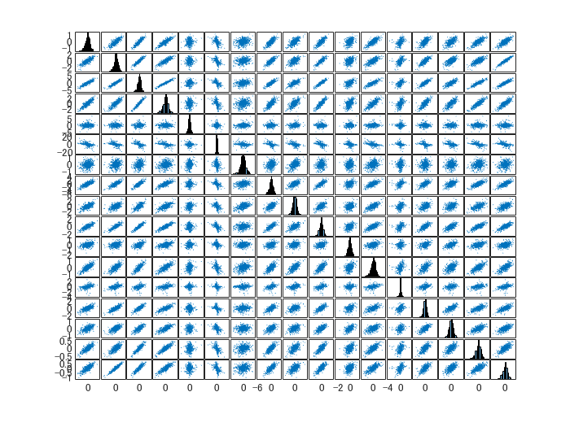

### ヒートマップ


相関係数を計算するには corrcoef 関数（[doc](https://jp.mathworks.com/help/matlab/ref/corrcoef.html)）。heatmap 関数（[doc](https://jp.mathworks.com/help/matlab/ref/heatmap.html)）を使ったヒートマップ表示も分かりやすいです。


```matlab:Code
corrETF = corrcoef(ETF2012.Variables);
etfNames = ETF2012.Properties.VariableNames; % 表示名（ティッカー名）
heatmap(etfNames,etfNames,corrETF)
```


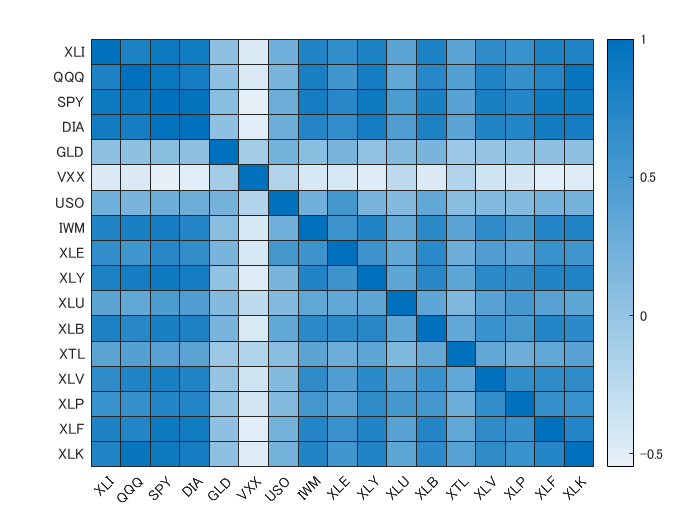

# 1.7.1 散布図
  

```matlab:Code
scatter(telcom.T, telcom.VZ)
xlabel("T");
ylabel("VZ")
```


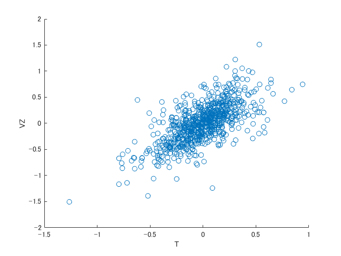


```matlab:Code

```

# 1.8 2つ以上の変数の探索
# 1.8.1 6角ビニングと等高線（２つの数値データをプロット）


ここからは `kc_tax.csv` のデータ（）を使用します。


```matlab:Code
kingCountry = readtable('..\psds_data\kc_tax.csv');
head(kingCountry)
```

| |TaxAssessedValue|SqFtTotLiving|ZipCode|
|:--:|:--:|:--:|:--:|
|1|NaN|1730|98117|
|2|206000|1870|98002|
|3|303000|1530|98166|
|4|361000|2000|98108|
|5|459000|3150|98108|
|6|223000|1570|98032|
|7|259000|1770|98168|
|8|175000|1150|98168|


`ZipCode` (郵便番号)、 `TaxAssessedValue`（課税標準額）と `SqFtTotLiving`（床面積）のデータが確認できます。


ここで、非常に高額、広すぎる・狭すぎるデータは除きます。


```matlab:Code
tooExpensive = kingCountry.TaxAssessedValue > 750000;
tooBig = kingCountry.SqFtTotLiving > 3500;
tooSmall = kingCountry.SqFtTotLiving < 100;
subKingCountry = kingCountry(~tooExpensive & ~tooBig & ~tooSmall,:);
height(subKingCountry)
```


```text:Output
ans = 433838
```


binscatter 関数（[doc](https://jp.mathworks.com/help/matlab/ref/binscatter.html)） でデータの分布状況を可視化します。


```matlab:Code
x = subKingCountry.SqFtTotLiving;
y = subKingCountry.TaxAssessedValue;
figure
binscatter(x,y);
xlabel('Total Sq.Ft of Living Space')
ylabel('Assessed Value for Tax Purposes')
```


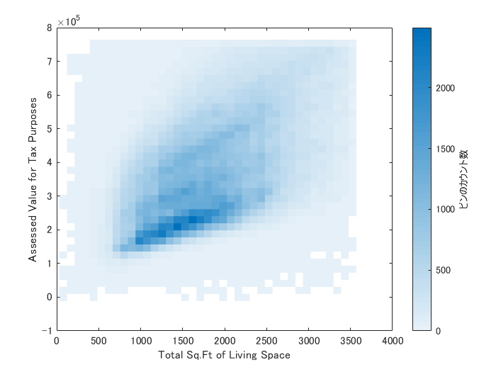


2次元ヒストグラムも有効かもしれません。


```matlab:Code
figure
histogram2(x,y)
xlabel('Total Sq.Ft of Living Space')
ylabel('Assessed Value for Tax Purposes')
```


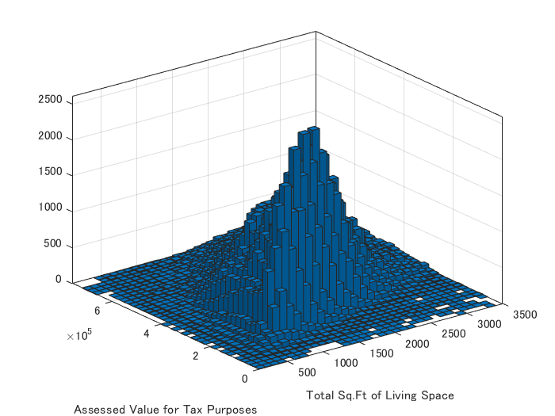


散布図の上にデータの密度を等高線図で描くのも良いです。`histcount2` 関数（[doc](https://jp.mathworks.com/help/matlab/ref/histcounts2.html)）を使って二変量ヒストグラムのビンのカウント数を算出して等高線図を描きます。


```matlab:Code
figure
scatter(x,y)
hold on
[N,Xedges,Yedges] = histcounts2(x,y);
Xcenter = (Xedges(1:end-1)+Xedges(2:end))/2; % 各ビンの両端の平均値（中央）
Ycenter = (Yedges(1:end-1)+Yedges(2:end))/2; % 各ビンの両端の平均値（中央）
[X,Y] = meshgrid(Xcenter,Ycenter);
contour(X,Y,N',20,'white')
hold off
xlabel('Total Sq.Ft of Living Space')
ylabel('Assessed Value for Tax Purposes')
```


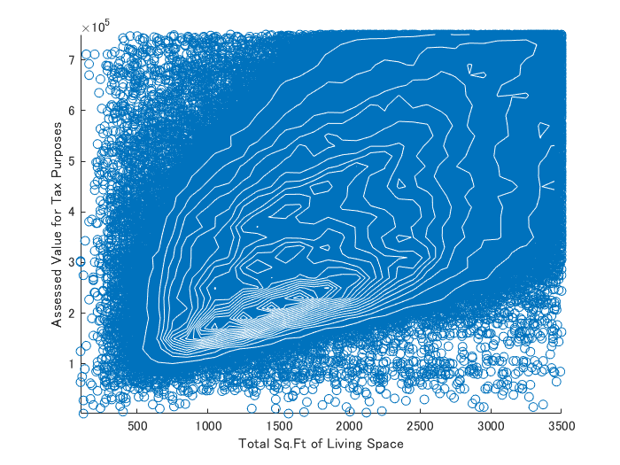

  
# 1.8.2 2 つのカテゴリ変数の探索


ここでは `lc_loans.csv` を使用します。ローンの等級と支払い状況。


```matlab:Code
lc_loans = readtable("..\psds_data\lc_loans.csv");
height(lc_loans)
```


```text:Output
ans = 450961
```


```matlab:Code
head(lc_loans)
```

| |status|grade|
|:--:|:--:|:--:|
|1|'Fully Paid'|'B'|
|2|'Charged Off'|'C'|
|3|'Fully Paid'|'C'|
|4|'Fully Paid'|'C'|
|5|'Current'|'B'|
|6|'Fully Paid'|'A'|
|7|'Current'|'C'|
|8|'Fully Paid'|'E'|


こんなローンの等級とステータス（支払い状況）が入っていますので、それぞれカテゴリ型配列に変換したうえで crosstab 関数（[doc](https://jp.mathworks.com/help/stats/crosstab.html)）でクロス集計します。４つ目の出力（`labels`）で各ラベル名を確認できます。


```matlab:Code
lc_loans.grade = categorical(lc_loans.grade);
lc_loans.status = categorical(lc_loans.status);
[tmp,~,~,labels] = crosstab(lc_loans.grade,lc_loans.status)
```


```text:Output
tmp = 7x4    
        1562       50051       20408         469
        5302       93852       31160        2056
        6023       88928       23147        2777
        5007       53281       13681        2308
        2842       24639        5949        1374
        1526        8444        2328         606
         409        1990         643         199

```

| |1|2|
|:--:|:--:|:--:|
|1|'A'|'Charged Off'|
|2|'B'|'Current'|
|3|'C'|'Fully Paid'|
|4|'D'|'Late'|
|5|'E'|[ ]|
|6|'F'|[ ]|
|7|'G'|[ ]|


数値行列だけでは味気ないので変数名も加えたテーブル型に変換。


```matlab:Code
array2table(tmp,'VariableNames',labels(1:4,2),"RowNames",labels(1:7,1))
```

| |Charged Off|Current|Fully Paid|Late|
|:--:|:--:|:--:|:--:|:--:|
|1 A|1562|50051|20408|469|
|2 B|5302|93852|31160|2056|
|3 C|6023|88928|23147|2777|
|4 D|5007|53281|13681|2308|
|5 E|2842|24639|5949|1374|
|6 F|1526|8444|2328|606|
|7 G|409|1990|643|199|

  
# 1.8.3 カテゴリデータと数量データ


ここでは `airline_stats.csv` を使います。下記のように航空会社別の遅延情報が入っています。 


```matlab:Code
airline = readtable('..\psds_data\airline_stats.csv');
airline.airline = categorical(airline.airline); % 航空会社名はカテゴリ型に。
head(airline)
```

| |pct_carrier_delay|pct_atc_delay|pct_weather_delay|airline|
|:--:|:--:|:--:|:--:|:--:|
|1|8.1532|1.9718|0.7621|American|
|2|5.9599|3.7061|1.5859|American|
|3|7.1573|2.7062|2.0267|American|
|4|12.1000|11.0333|0|American|
|5|7.3333|3.3656|1.7742|American|
|6|6.1639|3.2250|0.9750|American|
|7|7.7442|10.6423|1.4607|American|
|8|9.0702|8.0789|0.7281|American|


航空会社別に遅延率（`pct_carrier_delay`）を箱ひげ図にしてみます。boxplot 関数と boxchart 関数の双方で描いてみます。


```matlab:Code
figure
boxplot(airline.pct_carrier_delay, airline.airline)
ylim([0,50])
ylabel('Daily % of Delayed Flights')
```


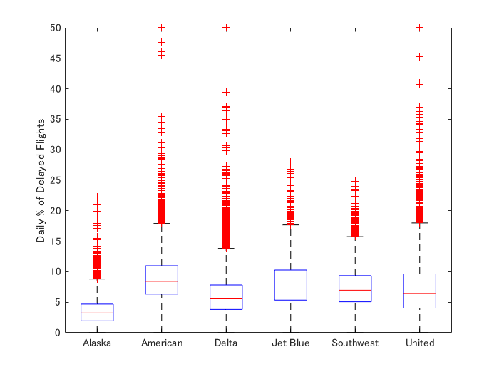


```matlab:Code
if ~verLessThan('matlab','9.8')
    % -- Code to run in MATLAB R2020a and later here --
    boxchart(airline.airline,airline.pct_carrier_delay)
    ylabel('Daily % of Delayed Flights')
end
```


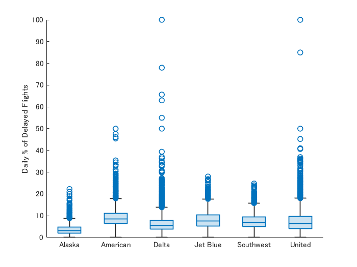


航空会社別の遅延パーセントの箱ひげ図でした。バイオリンプロットを描く MATLAB 標準関数はないが、File Exchange や GitHub にはいくつか関数が散見されます。


   -  例１：[https://github.com/bastibe/Violinplot-Matlab](https://github.com/bastibe/Violinplot-Matlab) 
   -  例２：[https://jp.mathworks.com/matlabcentral/fileexchange/23661-violin-plots-for-plotting-multiple-distributions-distributionplot-m](https://jp.mathworks.com/matlabcentral/fileexchange/23661-violin-plots-for-plotting-multiple-distributions-distributionplot-m) 

# 1.8.4 多変量の可視化


再び `kc_tax.csv` から床面積と標準課税額のデータ。 ここでは ZipCode 別の分布を確認します。


```matlab:Code
kingCountry = readtable('..\psds_data\kc_tax.csv');
head(kingCountry)
```

| |TaxAssessedValue|SqFtTotLiving|ZipCode|
|:--:|:--:|:--:|:--:|
|1|NaN|1730|98117|
|2|206000|1870|98002|
|3|303000|1530|98166|
|4|361000|2000|98108|
|5|459000|3150|98108|
|6|223000|1570|98032|
|7|259000|1770|98168|
|8|175000|1150|98168|


非常に高額、広すぎる・狭すぎるデータは除く


```matlab:Code
tooExpensive = kingCountry.TaxAssessedValue > 750000;
tooBig = kingCountry.SqFtTotLiving > 3500;
tooSmall = kingCountry.SqFtTotLiving < 100;
subKingCountry = kingCountry(~tooExpensive & ~tooBig & ~tooSmall,:);
height(subKingCountry)
```


```text:Output
ans = 433838
```


ZipCode 別の床面積 vs 課税額の分布を可視化すると地域差が確認できます。


```matlab:Code
x = subKingCountry.SqFtTotLiving;
y = subKingCountry.TaxAssessedValue;
zip = subKingCountry.ZipCode;

figure
subplot(2,2,1);
idx = zip == 98105;
binscatter(x(idx),y(idx));
xlabel('Total Sq.Ft of Living Space')
ylabel('Assessed Value for Tax Purposes')
title('ZipCode 98105')

subplot(2,2,2);
idx = zip == 98126;
binscatter(x(idx),y(idx));
xlabel('Total Sq.Ft of Living Space')
ylabel('Assessed Value for Tax Purposes')
title('ZipCode 98126')

subplot(2,2,3);
idx = zip == 98108;
binscatter(x(idx),y(idx));
xlabel('Total Sq.Ft of Living Space')
ylabel('Assessed Value for Tax Purposes')
title('ZipCode 98108')

subplot(2,2,4);
idx = zip == 98188;
binscatter(x(idx),y(idx));
xlabel('Total Sq.Ft of Living Space')
ylabel('Assessed Value for Tax Purposes')
title('ZipCode 98188')
```


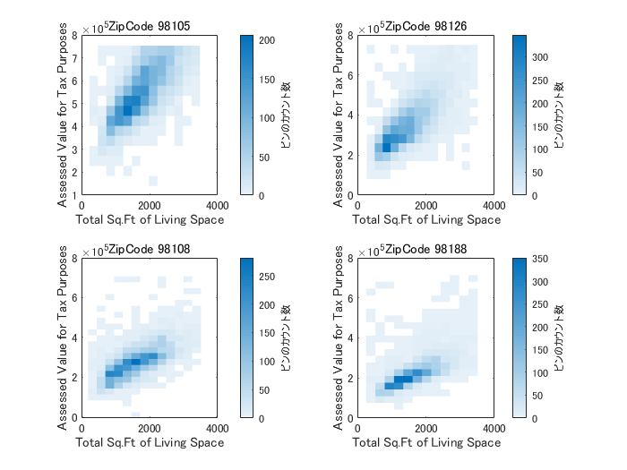

