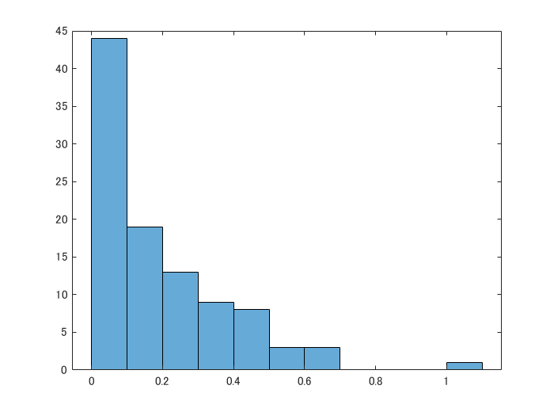

# Chapter 2 - Data and Sampling Distributions


以下は、「データサイエンスのための統計学入門」（Peter Bruce, Andrew Bruce、原題 Practical Statistics for Data Scientists）の第２章：データと標本の分布 を MATLAB で実行した例です。


もともとの R コードはこちら（[GitHub](https://github.com/andrewgbruce/statistics-for-data-scientists)）にあり、データも著者によって [Google Drive](https://drive.google.com/drive/folders/0B98qpkK5EJemYnJ1ajA1ZVJwMzg) もしくは [Dropbox](https://www.dropbox.com/sh/clb5aiswr7ar0ci/AABBNwTcTNey2ipoSw_kH5gra?dl=0) から入手可能です。データファイル（csv）はすべてフォルダ ..\psds_data 内にあるとします。


## 実行環境

   -  MATLAB R2020a 
   -  Statistics and Machine Learning Toolbox 

# 2.3  統計量の標本分布


Lending Club ローン申請者の年収の標本分布を調べます。


```matlab:Code
loans_income = table2array(readtable("../psds_data/loans_income.csv"));

% 1000件の単純無作為標本抽出
samp_data = randsample(loans_income,1000);

% 5件の平均値1000件からなる標本 (単純無作為に抽出した5000件の標本を頭から5件ずつとって平均)
samp_data05k = randsample(loans_income,1000*5);
for i = 1:1000
    for j = 1:5
        temp05(i,j) = samp_data05k(j+5*(i-1),1);
    end
end
samp_mean_05 = mean(temp05,2);

% 20件の平均値1000件からなる標本 (単純無作為に抽出した20,000件の標本を頭から20件ずつとって平均)
samp_data20k = randsample(loans_income,1000*20);
for i = 1:1000
    for j = 1:20
        temp20(i,j) = samp_data20k(j+20*(i-1),1);
    end
end
samp_mean_20 = mean(temp20,2);

% 各標本のヒストグラムをプロット
figure
edges = [0:5000:200000]; % 各プロットでビンの幅を共通にする

subplot(3,1,1)
histogram(samp_data, edges)
xlim([0 200000])
ylim([0 300])
title('Data')
xlabel('Income')
ylabel('Count')

subplot(3,1,2)
histogram(samp_mean_05, edges)
xlim([0 200000])
ylim([0 300])
title('Mean of 5')
xlabel('Income')
ylabel('Count')

subplot(3,1,3)
histogram(samp_mean_20, edges)
xlim([0 200000])
ylim([0 300])
title('Mean of 20')
xlabel('Income')
ylabel('Count')
```


# 2.4  ブートストラップ


標本データ (loans_income) からブートストラップ標本を生成して標本統計量のばらつきを調べます。


```matlab:Code
rng default  % For reproducibility
nboot = 1000;

% ブートストラップ中央値 (と、せっかくなので平均値、標準偏差も) を計算
bootstat = bootstrp(nboot,@(x)[median(x) mean(x) std(x)],loans_income); % Statistics and Machine Learning Toolbox 必要
origMed = median(loans_income); % オリジナルデータの中央値
biasBootMed = sum(bootstat(:,1) - origMed) /length(bootstat); % ブートストラップ中央値のバイアス
seBootMed = sqrt(sum((bootstat(:,1) -origMed).^2) /(length(bootstat) - 1)); % ブートストラップ中央値の標準誤差

display(["original" "bias" "std. error"; origMed biasBootMed seBootMed])
```


```text:Output
  2x3 の string 配列
    "original"    "bias"        "std. error"
    "62000"       "-74.0805"    "226.792264"
```

# 2.5  信頼区間


Lending Club のローン申請者の平均年収の90％信頼区間を調べます。


```matlab:Code
rng default % For reproducibility
samp_data20 = randsample(loans_income,20);
nboot = 1000;
bootMean = bootstrp(nboot,@mean,samp_data20); % Statistics and Machine learning Toolbox 必要
bootMean90Idx = bootMean >= prctile(bootMean,5) & bootMean <= prctile(bootMean,95); 
bootMean90 = bootMean(bootMean90Idx);
prc5 = prctile(bootMean,5);
prc95 = prctile(bootMean,95);
ci90x = linspace(prc5,prc95);
ci90y = (ci90x./ci90x).*55;

figure
histogram(bootMean,'BinWidth',1000)
title('20人の標本に基づくローン申請者の年収のブートストラップ信頼区間')
ylabel('Counts')
xline(prc5,'-',string(prc5),'Color','blue','LineWidth',1.5);
xline(prc95,'-',string(prc95),'Color','blue','LineWidth',1.5);
hold on
line(ci90x,ci90y,'Color','blue','LineWidth',1.5)
text(65000,60,' 90% interval','HorizontalAlignment','center','Color','blue','FontSize',14)
hold off
```


95% 信頼区間については MATLAB の bootci 関数 ([doc](https://jp.mathworks.com/help/stats/bootci.html)) が使えるのでやってみます。


```matlab:Code
rng 'default' % For reproducibility
bootMean95 = bootci(nboot,@mean,samp_data20); % Statistics and Machine learning Toolbox 必要
ci95x = linspace(min(bootMean95),max(bootMean95));
ci95y = (ci95x./ci95x).*55;

figure
histogram(bootMean,'BinWidth',1000)
title('20人の標本に基づくローン申請者の年収のブートストラップ信頼区間 (95%)')
ylabel('Counts')
xline(min(bootMean95),'-',string(min(bootMean95)),'Color','red','LineWidth',1.5,'LabelHorizontalAlignment','left');
xline(prc5,'-',string(prc5),'Color','blue','LineWidth',1.5);
xline(max(bootMean95),'-',string(max(bootMean95)),'Color','red','LineWidth',1.5);
xline(prc95,'-',string(prc95),'Color','blue','LineWidth',1.5);
hold on
line(ci95x,ci95y,'Color','red','LineWidth',1.5)
text(65000,60,' 95% interval','HorizontalAlignment','center','Color','red','FontSize',14)
hold off
```


# 2.6  正規分布
## **2.6.1  標準正規分布とQQプロット**


正規分布した100個の乱数を生成してQQプロットを描いてみます。


```matlab:Code
norm_samp = randn(100,1); % 正規分布した100個の乱数を生成
qqplot(norm_samp) % Statistics and Machine Learning Toolbox 必要
```


# 2.7  ロングテールの分布


Netflix (NFLX) の日次収益の QQ プロット


```matlab:Code
warning('off','MATLAB:table:ModifiedAndSavedVarnames'); % 元データの日付列変数名が空白のため読み込み実行時に出る警告を非表示
sp500_px = table2timetable(readtable('../psds_data/sp500_data.csv')); 
sp500_px.Properties.DimensionNames{'Var1'} = 'Date'; % 日付列に名前を付ける
nflx = sp500_px.NFLX; % Netflix の日次収益
```


まずそのままのデータをプロットしてみます。


```matlab:Code
plot(nflx) % Netflix の日次収益変動を確認
title('NFLX 日次収益の変動')
```


次いで kurtosis 関数 ([doc](https://jp.mathworks.com/help/stats/kurtosis.html)) で尖度を確認。かなりとんがった分布であることが分かります。


```matlab:Code
k = kurtosis(nflx) % Statistics and Machine Learning Toolbox 必要
```


```text:Output
k = 67.1371
```


まずは Netflix のデータ全体について QQ プロットを描いてみます。


```matlab:Code
qqplot(nflx) % Statistics and Machine Learning Toolbox 必要
```


テキストではプラス収益のデータを抽出しているようなので、今度はこれに沿ってプロットしてみます。


```matlab:Code
nflx = sp500_px.NFLX(sp500_px.NFLX > 0); %Netflix の日次収益 (プラス (>0) の場合のみ)
nflxDiffLog = diff(log(nflx)); % 対数差分系列
qqplot(nflxDiffLog) % Statistics and Machine Learning Toolbox 必要
title('NFLX 日次収益のQQプロット')
```


# 2.9  二項分布


ex.1) 各試行の成功確率p＝0.1で、size＝5回の試行で、x＝2回成功する確率を求めます。 (二項確率密度関数 binopdf ([doc](https://jp.mathworks.com/help/stats/binopdf.html)) 使用)


```matlab:Code
ex1 = binopdf(2,5,0.1) % Statistics and Machine Learning Toolbox 必要
```


```text:Output
ex1 = 0.0729
```


ex.2) 各試行の成功確率p＝0.1で、size＝5回の試行で、成功がx＝2回以下となる確率を求めます。 (二項累積分布関数 binocdf ([doc](https://jp.mathworks.com/help/stats/binocdf.html)) 使用)


```matlab:Code
ex2 = binocdf(2,5,0.1) % Statistics and Machine Learning Toolbox 必要
```


```text:Output
ex2 = 0.9914
```


クリックが売上につながる確率を0.02とすると、200回のクリックでも売上 が0になる確率はどのくらいか。


```matlab:Code
conv = binopdf(0,200,0.02)
```


```text:Output
conv = 0.0176
```

# 2.10  ポアソン分布と関連する分布
## **2.10.1  ポアソン分布**


関数 poissrnd ([doc](https://jp.mathworks.com/help/stats/poissrnd.html)) を使ってポアソン分布による乱数を生成します (λ = 2)。 


```matlab:Code
randPois = poissrnd(2,[100,1]); % Statistics and Machine Learning Toolbox 必要
histogram(randPois)
```


## **2.10.2  指数分布**


関数 exprnd ([doc](https://jp.mathworks.com/help/stats/exprnd.html)) を使って指数分布による乱数を生成します (λ=0.2)。


```matlab:Code
randExp = exprnd(0.2,[100,1]); % Statistics and Machine Learning Toolbox 必要
histogram(randExp)
```




## **2.10.4  ワイブル分布**


関数 wblrnd ([doc](https://jp.mathworks.com/help/stats/wblrnd.html)) を使ってワイブル分布 (η=5000, β=1.5) による乱数を生成します。


```matlab:Code
randWeib = wblrnd(5000,1.5,[100,1]); % Statistics and Machine Learning Toolbox 必要
histogram(randWeib)
```


