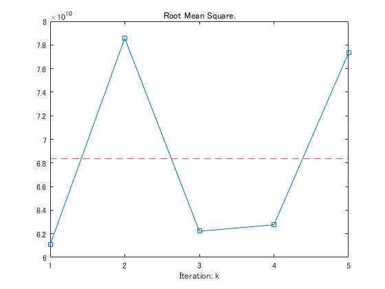

# Chapter 4. Regression and Prediction

```matlab:Code
clear; close all;
dataDir = "../psds_data";
dataList = dir(dataDir);
dataList.name
```


```text:Output
ans = '.'
ans = '..'
ans = '762609057_112015_3429_airline_delay_causes.csv'
ans = 'County_Zhvi_AllHomes.csv'
ans = 'LungDisease.csv'
ans = 'airline_stats.csv'
ans = 'click_rates.csv'
ans = 'dfw_airline.csv'
ans = 'four_sessions.csv'
ans = 'full_train_set.csv'
ans = 'house_sales.csv'
ans = 'imanishi_data.csv'
ans = 'kc_tax.csv'
ans = 'lc_loans.csv'
ans = 'loan200.csv'
ans = 'loan3000.csv'
ans = 'loan_data.csv'
ans = 'loans_income.csv'
ans = 'sp500_data.csv'
ans = 'sp500_sectors.csv'
ans = 'state.csv'
ans = 'web_page_data.csv'
```

# Simple Linear Regression
## The regression Equation


```matlab:Code
lung = readtable(fullfile(dataDir, "LungDisease.csv"));
head(lung)
```

| |PEFR|Exposure|
|:--:|:--:|:--:|
|1|390|0|
|2|410|0|
|3|430|0|
|4|460|0|
|5|420|1|
|6|280|2|
|7|420|2|
|8|520|2|


```matlab:Code
sc1 = scatter(lung.Exposure, lung.PEFR,'ok', 'SizeData', 30);
ax1 = sc1.Parent;
axis(ax1, 'square');
xlabel(ax1, "Exposure");
ylabel(ax1, "PEFR");
%
ax1.XTick = [0 5 10 15 20];
ax1.YTick = [100 200 300 400 500 600];
ax1.XLim = [-1, 24];
ax1.YLim = [90, 630];
ax1.FontSize = 14;
ax1.TickDir = "out";
ax1.Color = "none";
ax1.Box = "on";
```


```matlab:Code
model = fitlm(lung, "PEFR~Exposure");
disp(model);
```


```text:Output
線形回帰モデル: 
    PEFR ~ 1 + Exposure

推定された係数: 
                   Estimate      SE       tStat       pValue  
                   ________    ______    _______    __________

    (Intercept)     424.58     20.796     20.417    7.5122e-41
    Exposure       -4.1846      1.325    -3.1582     0.0020084

観測数: 122、誤差の自由度: 120
平方根平均二乗誤差: 101
決定係数: 0.0767、自由度調整済み決定係数: 0.069
F 統計量 - 定数モデルとの比較: 9.97、p 値は 0.00201 です
```

## Fitted Values and Residuals


The error is denoted by  and the fitted value , and the residuals  respectively: 


fitted and residual:


```matlab:Code
fitted = model.Fitted;
resid = model.Residuals;
```


Plotting them together:


```matlab:Code
p2 = plot(lung.Exposure, fitted, '-b',...
    lung.Exposure, lung.PEFR, 'ok', "MarkerSize",6);
ax2 = p2.Parent;
axis(ax2,"square");
xlabel(ax2, "Exposure");
ylabel(ax2, "PEFR");
%
ax2.XTick = [0 5 10 15 20];
ax2.YTick = [100 200 300 400 500 600];
ax2.XLim = [-1, 24];
ax2.YLim = [90, 630];
ax2.FontSize = 14;
ax2.TickDir = "out";
ax2.Color = "none";
ax2.Box = "on";
%
hold on;
for i=1:length(lung.PEFR)
    plot([lung.Exposure(i), lung.Exposure(i)], [lung.PEFR(i), fitted(i)],'r:');
end
hold off;
```


## Least Squares


Residual sum of squares - RSS


# Multiple Linear Regression


The fitted values are given by:


  
## Example: King County Housing Data

```matlab:Code
% データ読み込みオプション
opts = delimitedTextImportOptions("NumVariables", 23);

% 範囲と区切り記号の指定
opts.DataLines = [2, Inf];
opts.Delimiter = "\t";

% 列名と型の指定
% Note that: SaleDateは無かったので加筆
opts.VariableNames = ["DocumentDate","SaleDate", "SalePrice", "PropertyID", "PropertyType", "ym", "zhvi_px", "zhvi_idx", "AdjSalePrice", "NbrLivingUnits", "SqFtLot", "SqFtTotLiving", "SqFtFinBasement", "Bathrooms", "Bedrooms", "BldgGrade", "YrBuilt", "YrRenovated", "TrafficNoise", "LandVal", "ImpsVal", "ZipCode", "NewConstruction"];
opts.VariableTypes = ["double", "datetime", "double", "double", "categorical", "datetime", "double", "double", "double", "double", "double", "double", "double", "double", "double", "double", "double", "double", "double", "double", "double", "double", "categorical"];

% ファイル レベルのプロパティを指定
opts.ExtraColumnsRule = "ignore";
opts.EmptyLineRule = "read";

% 変数プロパティを指定
opts = setvaropts(opts, ["PropertyType", "NewConstruction"], "EmptyFieldRule", "auto");
opts = setvaropts(opts, "SaleDate", "InputFormat", "yyyy-MM-dd");
opts = setvaropts(opts, "ym", "InputFormat", "yyyy-MM-dd");

% データ読み込み
house = readtable(fullfile(dataDir, "house_sales.csv"), opts);
head(house(:,{'AdjSalePrice','SqFtTotLiving','SqFtLot','Bathrooms', 'Bedrooms', 'BldgGrade'}))
```

| |AdjSalePrice|SqFtTotLiving|SqFtLot|Bathrooms|Bedrooms|BldgGrade|
|:--:|:--:|:--:|:--:|:--:|:--:|:--:|
|1|300805|2400|9373|3.0000|6|7|
|2|1076162|3764|20156|3.7500|4|10|
|3|761805|2060|26036|1.7500|4|8|
|4|442065|3200|8618|3.7500|5|7|
|5|297065|1720|8620|1.7500|4|7|
|6|411781|930|1012|1.5000|2|8|
|7|380785|1750|34465|1.5000|3|8|
|8|349489|1860|14659|1.7500|4|7|


Establish a model that drop records with missing values:


```matlab:Code
% Remove missing records from the table
%house_cleaned = rmmissing(house,2);
house_cleaned = house;

% Model
house_lm = fitlm(house_cleaned, "AdjSalePrice ~ SqFtTotLiving + SqFtLot + Bathrooms + Bedrooms + BldgGrade");
```

## Assessing the Model P175

```matlab:Code
disp(house_lm);
```


```text:Output
線形回帰モデル: 
    AdjSalePrice ~ 1 + SqFtLot + SqFtTotLiving + Bathrooms + Bedrooms + BldgGrade

推定された係数: 
                      Estimate         SE        tStat        pValue   
                     ___________    ________    ________    ___________

    (Intercept)      -5.2192e+05       15651     -33.349    4.2325e-238
    SqFtLot            -0.060506    0.061181    -0.98896        0.32269
    SqFtTotLiving         228.83      3.8984      58.699              0
    Bathrooms             -19438      3625.2     -5.3619     8.3151e-08
    Bedrooms              -47781      2489.4     -19.194     1.8564e-81
    BldgGrade         1.0612e+05      2396.1      44.287              0

観測数: 22689、誤差の自由度: 22683
平方根平均二乗誤差: 2.61e+05
決定係数: 0.541、自由度調整済み決定係数: 0.541
F 統計量 - 定数モデルとの比較: 5.34e+03、p 値は 0 です
```


Residual:


```matlab:Code
summary(house_lm.Residuals);
```


```text:Output
Variables:

    Raw: 22689x1 double

        Values:

            Min       -1.1995e+06
            Median         -20982
            Max         9.473e+06

    Pearson: 22689x1 double

        Values:

            Min         -4.5915
            Median    -0.080315
            Max          36.261

    Studentized: 22689x1 double

        Values:

            Min         -4.5963
            Median    -0.080321
            Max          37.395

    Standardized: 22689x1 double

        Values:

            Min         -4.5943
            Median    -0.080323
            Max          36.294
```


Residual - 1Q, Median, 3Q:


```matlab:Code
quantile(house_lm.Residuals{:,"Raw"},3)
```


```text:Output
ans = 1x3    
1.0e+05 *

   -1.1889   -0.2098    0.8742

```

## Cross-Validation


k-fold cross-validation:


```matlab:Code
k = 5;
c = cvpartition(size(house_cleaned,1), 'KFold', k);
mse = zeros(1,k);

for i=1:k
    idx_train = training(c,i);
    idx_test = test(c,i);
    
    trainTable = house_cleaned(idx_train,:);
    testTable = house_cleaned(idx_test,:);
    
    mdl = fitlm(trainTable, "AdjSalePrice ~ SqFtTotLiving + SqFtLot + Bathrooms + Bedrooms + BldgGrade");
    yfit = feval(mdl,testTable);
    mse(i) = mean((yfit-testTable.AdjSalePrice).^2);
end

% visualize
plot(1:k, mse,'s-');
yline(mean(mse),'r--');
title("Root Mean Square.");
xticks(1:5); xlabel("Iteration: k")
```




  
## Model Selection and Stepwise Regression P178
  

```matlab:Code
house_full = fitlm(house_cleaned, "AdjSalePrice ~ SqFtTotLiving + SqFtLot + Bathrooms + Bedrooms + BldgGrade + PropertyType + NbrLivingUnits + SqFtFinBasement + YrBuilt + YrRenovated + NewConstruction");
```

