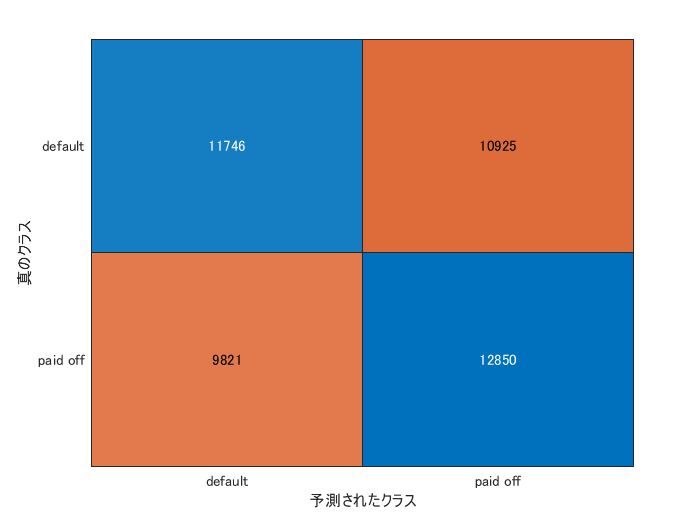
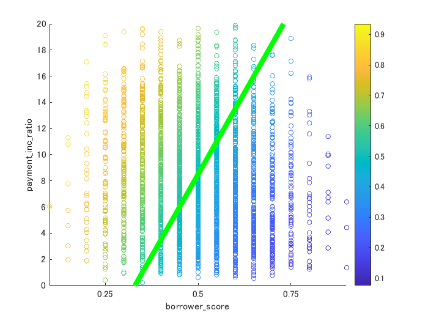

# Chapter 5 - Classification


以下は、「データサイエンスのための統計学入門」（Peter Bruce, Andrew Bruce、原題 Practical Statistics for Data Scientists）の第５章：データと標本の分布 を MATLAB で実行した例です。


もともとの R コードはこちら（[GitHub](https://github.com/andrewgbruce/statistics-for-data-scientists)）にあり、データも著者によって [Google Drive](https://drive.google.com/drive/folders/0B98qpkK5EJemYnJ1ajA1ZVJwMzg) もしくは [Dropbox](https://www.dropbox.com/sh/clb5aiswr7ar0ci/AABBNwTcTNey2ipoSw_kH5gra?dl=0) から入手可能です。データファイル（csv）はすべてフォルダ ..\psds_data 内にあるとします。


## 実行環境

   -  MATLAB R2020a 
   -  Statistics and Machine Learning Toolbox 

# 5.1  ナイーブベイズ
## 5.1.2  ナイーブベイズ解


ローンデータ loan_data.csv を読み込んで、目的、住居（所有、賃貸など）、勤続年数を予測子としたモデルを生成します。Statistics and Machine Learning Toolbox の fitcnb 関数 ([doc](https://jp.mathworks.com/help/stats/fitcnb.html)) を使用。


```matlab:Code
loan_data = readtable('..\psds_data\loan_data.csv');
missIdx = sum(ismissing(loan_data),2) > 0; % 欠損値をチェック
loan_data = loan_data(~missIdx,:);

% マルチクラス単純ベイズモデルを学習
Mdl = fitcnb(loan_data,'outcome~ purpose_ + home_ + emp_len_'); % Statistics and Machine Learning Toolbox 必要
```


推定された分布パラメータを表示します。


```matlab:Code
distParam = Mdl.DistributionParameters
```

| |1|2|3|
|:--:|:--:|:--:|:--:|
|1|[0.1515;0.5756;0.059...|[0.4313;0.0833;0.485...|[0.0473;0.9527]|
|2|[0.1876;0.5520;0.071...|[0.4895;0.0809;0.429...|[0.0311;0.9689]|


行の順序は ClassNames プロパティのクラスの順序に、予測子の順序は X の列の順序に対応しています。


```matlab:Code
rawNames = Mdl.ClassNames
```


```text:Output
rawNames = 2x1 cell    
'default'     
'paid off'    

```


```matlab:Code
colNames = Mdl.X.Properties.VariableNames
```


```text:Output
colNames = 1x3 cell    
'purpose_'    'home_'      'emp_len_'    

```


それぞれの予測子に対応した分布パラメータを見ていきます。まずは 'purpose_' 


```matlab:Code
distParam_purpose = [distParam{1,1}';distParam{2,1}'];
purposeCat = categories(categorical(Mdl.X.purpose_))';
outcomeCat = Mdl.ResponseName;
display([outcomeCat purposeCat; rawNames num2cell(distParam_purpose)])
```


```text:Output
  3x8 の cell 配列

    {'outcome' }    {'credit_card'}    {'debt_consolidat…'}    {'home_improvement'}    {'major_purchase'}    {'medical'}    {'other' }    {'small_business'}
    {'default' }    {[     0.1515]}    {[           0.5756]}    {[          0.0598]}    {[        0.0373]}    {[ 0.0144]}    {[0.1156]}    {[        0.0458]}
    {'paid off'}    {[     0.1876]}    {[           0.5520]}    {[          0.0715]}    {[        0.0536]}    {[ 0.0143]}    {[0.0999]}    {[        0.0210]}
```


続いて 'home_'


```matlab:Code
distParam_home = [distParam{1,2}';distParam{2,2}'];
homeCat = categories(categorical(Mdl.X.home_))';
display([outcomeCat homeCat; rawNames num2cell(distParam_home)])
```


```text:Output
  3x4 の cell 配列

    {'outcome' }    {'MORTGAGE'}    {'OWN'   }    {'RENT'  }
    {'default' }    {[  0.4313]}    {[0.0833]}    {[0.4854]}
    {'paid off'}    {[  0.4895]}    {[0.0809]}    {[0.4296]}
```


ラストは 'emp_len_'


```matlab:Code
distParam_emp = [distParam{1,3}';distParam{2,3}'];
empCat = categories(categorical(Mdl.X.emp_len_))';
display([outcomeCat empCat; rawNames num2cell(distParam_emp)])
```


```text:Output
  3x3 の cell 配列

    {'outcome' }    {'< 1 Year'}    {'> 1 Year'}
    {'default' }    {[  0.0473]}    {[  0.9527]}
    {'paid off'}    {[  0.0311]}    {[  0.9689]}
```


新たなローンの結果を推定します。Statistics and Machine Learning Toolbox の resubPredict 関数 ([doc](https://jp.mathworks.com/help/stats/classificationnaivebayes.resubpredict.html)) を使用。


```matlab:Code
idx = 147;
new_loan = loan_data(idx,{'purpose_','home_','emp_len_'});
[label,Posterior,~] = resubPredict(Mdl); % Statistics and Machine Learning Toolbox 必要

```


予測の結果は「返済不能」


```matlab:Code
disp(label(idx,1))
```


```text:Output
    {'default'}
```


各予測クラスの事後確率を表示


```matlab:Code
disp([{Mdl.ClassNames{1} Mdl.ClassNames{2}}; num2cell(Posterior(idx,:))])
```


```text:Output
    {'default'}    {'paid off'}
    {[ 0.6534]}    {[  0.3466]}
```


なお、テキストにはないですが、真のラベルと予測ラベルの混同行列チャートを作成してみます。今回のモデルだと、正確な予測は難しいということかな？？


```matlab:Code
cm = confusionchart(loan_data.outcome,label(:,1)) % Statistics and Machine Learning Toolbox 必要
```





```text:Output
cm = 
  ConfusionMatrixChart のプロパティ:

    NormalizedValues: [2x2 double]
         ClassLabels: {2x1 cell}

  すべてのプロパティ を表示

```

# 5.2  判別分析
## 5.2.3  簡単な例 (フィッシャーの線形判別)


データを読み込んで、判別分析モデルを生成します。Statistics and Machine Learning Toolbox の fitcdiscr ([doc](https://jp.mathworks.com/help/stats/fitcdiscr.html)) を使用。fitcdiscr は判別タイプを指定できますが、何も指定しないと 'linear' となります。


```matlab:Code
loan3000 = readtable('..\psds_data\loan3000.csv');
loan_lda = fitcdiscr(loan3000,'outcome~ borrower_score + payment_inc_ratio');
```


作成したモデルをもとに「返済不能」と「完済」の確率を予測します。


```matlab:Code
[labelLda,posteriorLda,~] = predict(loan_lda,loan3000);
% 予測クラス名を変数名に指定してテーブルに変換
posteriorLda = array2table(posteriorLda,'VariableNames',{loan_lda.ClassNames{1},loan_lda.ClassNames{2}});
head(posteriorLda)
```

| |default|paid off|
|:--:|:--:|:--:|
|1|0.5535|0.4465|
|2|0.5590|0.4410|
|3|0.2727|0.7273|
|4|0.5063|0.4937|
|5|0.6100|0.3900|
|6|0.4107|0.5893|
|7|0.5853|0.4147|
|8|0.6347|0.3653|


予測結果をプロット。


なおRコードで散布図のプロットに使われているデータ (lda_df) はテキスト内では定義されていない変数のようですが、loan3000 のデータを borrower_score をX軸、 payment_inc_ratio をY軸にとってプロットし、「返済不能」の確率で色付けしたものが書かれているようなので、lda_df を以下のように定義します。色合いはカラフルなのが好みなのでMATLABのデフォルトカラーマップを使います。


```matlab:Code
% 散布図のプロットに使うデータを定義
lda_df = [loan3000,  posteriorLda(:,1)];

% 散布図を描画
scatter(lda_df.borrower_score,lda_df.payment_inc_ratio,20,lda_df.default)
xticks([0.25,0.50,0.75])
ylim([0 20])
xlabel('borrower\_score')
ylabel('payment\_inc\_ratio')
colorbar

% 予測クラスを分割する線を引くため、新たなデータセットを作成
x = linspace(.33,.73,100)';
y = linspace(0,20,100)';
newdata = array2table(cat(2,x,y),'VariableNames',{'borrower_score','payment_inc_ratio'});
[classNew, posteriorNew, ~] = predict(loan_lda,newdata);
outcome = array2table(classNew,'VariableNames',{'outcome'});
lda_df0 = [newdata, outcome];

% 分割線を描画
hold on
line(lda_df0.borrower_score,lda_df0.payment_inc_ratio,'LineWidth',5,'Color','green')
hold off
```





```matlab:Code

```

